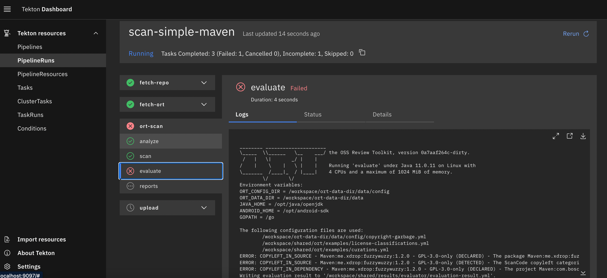
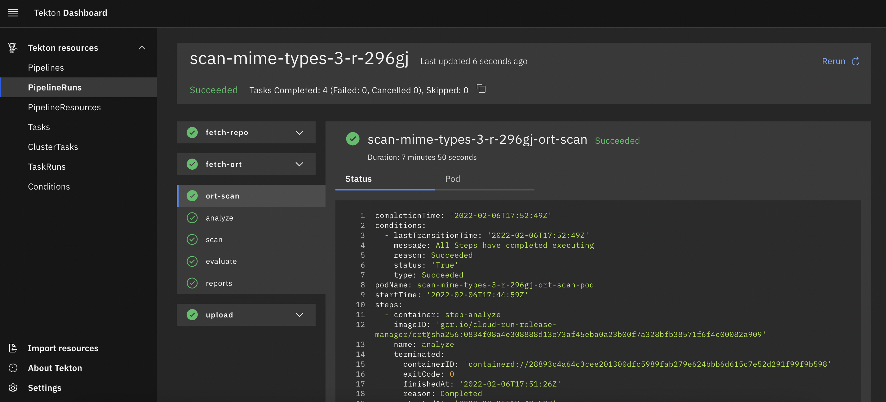

# Tekton Pipeline Example

This example allows you to run ORT on [Tekton](https://tekton.dev/). Some previous knowledge about Tekton and Kubernetes
will help for the general understanding. The pipeline works best on
[Google Kubernetes Engine](https://cloud.google.com/kubernetes-engine) (GKE), since it allows to use Workload Identity
to authenticate against [Google Cloud Storage](https://cloud.google.com/products/storage) (GCS) instead of exporting and
uploading Service Account Keys.

## Getting Started

To run the pipeline, you will need the following things:
* A Kubernetes cluster with Tekton installed (follow the
  [installation instructions](https://tekton.dev/docs/pipelines/install/)).
* You will need to install the [git-clone](https://hub.tekton.dev/tekton/task/git-clone) and
  [gcs-upload](https://hub.tekton.dev/tekton/task/gcs-upload) tasks.
* A [Google Cloud Storage](https://cloud.google.com/products/storage) bucket.

The pipeline is defined in `ort-pipeline.yaml`. You will need to replace `ort:latest` with the full image name, e.g.
`gcr.io/<project_id>/ort:latest`.

The pipeline takes a few inputs:
* `shared-data` is a workspace and will need a volume. It is used for checking out the source code repo, and for storing
  the temporary artifacts.
* `gcs-credentials` is a workspace and will need a volume. On GKE, you can use Workload Identities to allow the
  Kubernetes Service Account (KSA) to access the GCS bucket for uploading the results. (If you are not using Workload
  Identity, find more information how to configure credentials in the
  [gcs-upload](https://hub.tekton.dev/tekton/task/gcs-upload) documentation.)
* `repo-url` is a parameter and takes the path to the Git repo that should be scanned.
* `result-bucket-path` is a parameter and takes the path to GCS where the result report should be stored e.g.
  `gs://<gcs-bucket>/<sub_path>`.

In order to get started, call `kubectl apply -f ort-pipeline.yaml` to create the pipeline on your Kubernetes cluster.
Next, you need to create a `PipelineRun` resource. In order to trigger a run, e.g. for the
[Simple Maven example](https://github.com/MarcelBochtler/maven-simple), you can call
`kubectl apply -f simple-maven.yaml`. (Or `kubectl apply -f mime-types.yaml` for the
[Mime Types repo](https://github.com/jshttp/mime-types).)

## Next Steps

You probably do not want to trigger each execution via `kubectl`. Check out the
[Tekton documentation](https://tekton.dev/docs/triggers/) to learn how you can trigger a _PipelineRun_ via
_EventListeneres_.

If you are not working on a public GitHub repository, you should also check out how to work with a
[private repo](https://hub.tekton.dev/tekton/task/git-clone).
