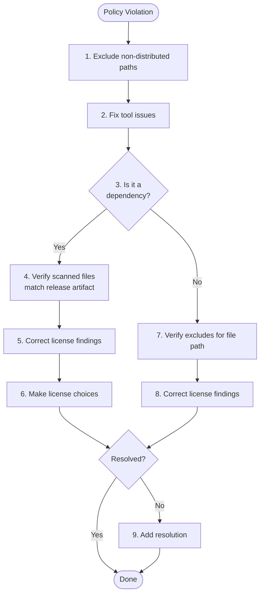

# How to address a license policy violation

License policy violations occur when ORT finds licenses that are in compliant with your policy rules.

Common causes include:

* **Scanner found licenses in files you don't distribute** (tests, build scripts, examples)
* **Scanner misidentified a license** (uncertain match or false positive from similar text)
* **License isn't in your policy yet** (new dependency with an unhandled license)
* **Scanned sources don't match what you release** (monorepo, bundled deps, extra files)

Follow this flowchart to identify the appropriate fix.



## 1. Exclude non-distributed paths

Add [path or scope excludes][how-to-exclude] in your `.ort.yml` to mark build tools, tests, and documentation as not part of your released artifacts.

## 2. Fix tool issues

If there are analyzer or scanner errors for the package with the policy violation, [address these][how-to-tool-issues] first.

## 3. Dependency or project?

Check the package identifier in the violation message. If it matches the identifier of your project, the violation is in your project's source code - skip to step 7. If it's a third-party package or a package defined inline in your project, continue with step 4.

The distinction matters because fixes for packages go into package configurations (shared, reusable), while fixes for your project go into your `.ort.yml` (project-specific).

## 4. Verify scanned files match the release artifact

License compliance is about what you actually distribute. If ORT scanned files that aren't in your release artifact, any licenses found in those extra files don't apply to your distribution. This mismatch is a common source of false policy violations.

To verify:

1. Extract the release artifact you're using (binary or source) to a folder
2. Extract what ORT scanned (source artifact or VCS checkout) to another folder
3. Compare the contents - are there extra files in what ORT scanned?

### VCS contains multiple packages

**How to recognize:** The package comes from a monorepo or a repository that publishes multiple packages. ORT scanned the entire repository, but you only use one package from it.

Add a [package curation][package-curations] with a VCS path to limit scanning to the relevant subdirectory:

```yaml
- id: "Maven:com.example:library:1.0.0"
  curations:
    comment: "Limit scan to the library subdirectory in the monorepo."
    vcs:
      path: "packages/library"
```

### Artifact (source or binary) has bundled dependencies

**How to recognize:** The release artifact contains more code than the source repository, typically because the package bundles its dependencies (common in JavaScript, Go, or native builds).

You need to trace these bundled dependencies and ensure they're scanned too. Use [`package-list.yml`][how-to-add-packages] to define the additional packages.

### Source contains more than artifact (source or binary)

**How to recognize:** The source repository contains files that aren't in the release artifact (tests, examples, build scripts, documentation). This is the most common scenario.

Create a [package configuration with path excludes][how-to-exclude] to mark these files as not part of the released artifact.

## 5. Correct license findings (package)

If the scanner detected incorrect licenses in a package, use a [package configuration][package-configurations] with [license finding curations][how-to-correct-licenses].

## 6. Make license choices

If the package offers multiple licenses (e.g., `MIT OR Apache-2.0`), use [license choices][how-to-license-choice] in your `.ort.yml` to select one.

## 7. Verify excludes for project file

If the policy violation is for a file in your project, verify your [`.ort.yml` excludes][how-to-exclude] cover that file path.

## 8. Correct license findings (project)

If the scanner detected incorrect licenses in your project's source code, add a [license finding curation or concluded license][how-to-correct-licenses] to your `.ort.yml`.

## 9. Add a resolution

⚠️ Resolutions are a last resort, not a fix. They mark violations as "acknowledged" without actually fixing the underlying issue, and they do not change the licenses reported in generated SBOMs or NOTICE files. Before adding a resolution, make sure you've exhausted the options in steps 1-8.

Add a rule violation resolution to your `.ort.yml`:

```yaml
resolutions:
  rule_violations:
  - message: "UNHANDLED_LICENSE.*Crate::example-lib:1.0.0"
    reason: "CANT_FIX_EXCEPTION"
    comment: "Accepted after legal review. See JIRA-1234."
```

## Related resources

* How-to guides
  * [How to add non-detected packages][how-to-add-packages]
  * [How to address tool issues][how-to-tool-issues]
  * [How to correct licenses][how-to-correct-licenses]
  * [How to exclude dirs, files, or scopes][how-to-exclude]
  * [How to make a license choice][how-to-license-choice]
* Reference
  * [Package configurations][package-configurations]
  * [Package curations][package-curations]
  * [Repository configuration (.ort.yml)][ort-yml]
  * [Resolutions][resolutions]

[how-to-add-packages]: how-to-add-non-detected-or-supported-packages.md
[how-to-correct-licenses]: how-to-correct-licenses.md
[how-to-exclude]: how-to-exclude-dirs-files-or-scopes.md
[how-to-license-choice]: how-to-make-a-license-choice.md
[how-to-tool-issues]: how-to-address-tool-issues.md
[ort-yml]: ../reference/configuration/ort-yml.md
[package-configurations]: ../reference/configuration/package-configurations.md
[package-curations]: ../reference/configuration/package-curations.md
[resolutions]: ../reference/configuration/resolutions.md
