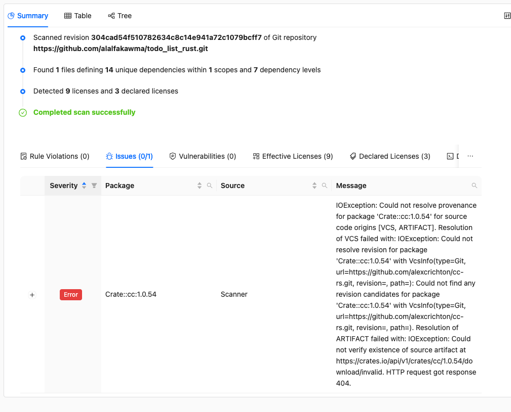
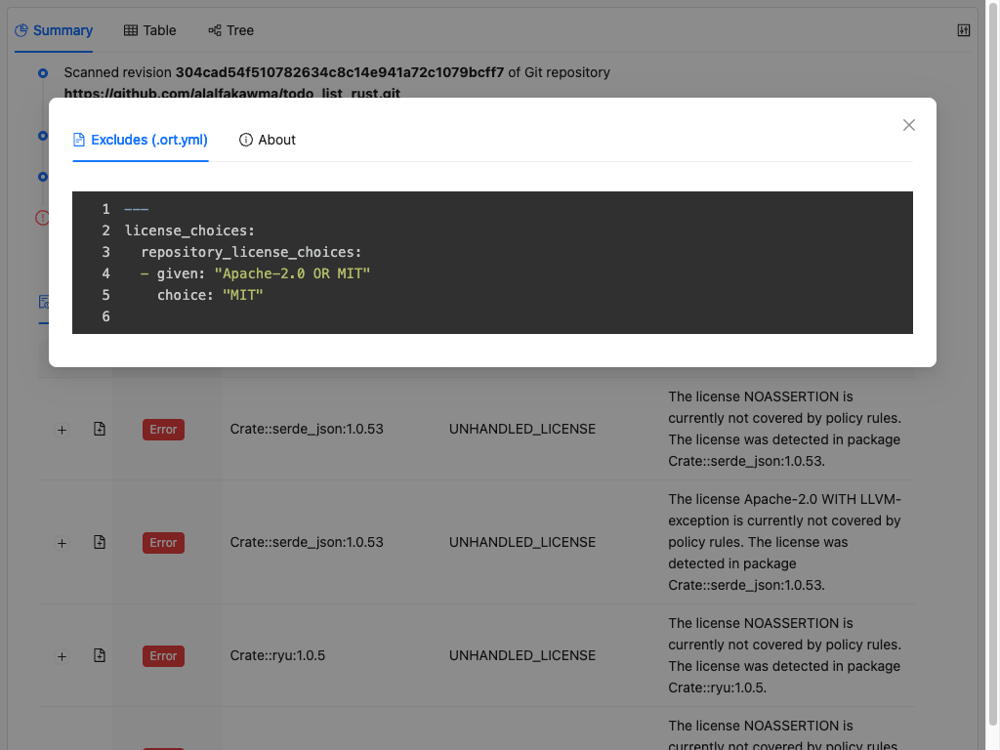
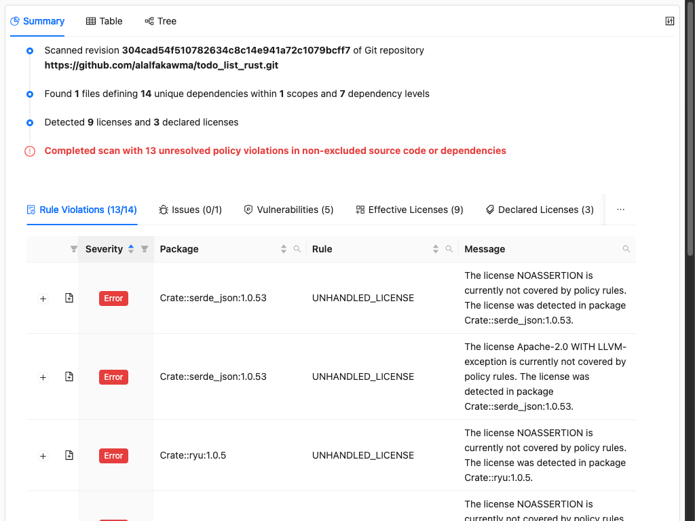
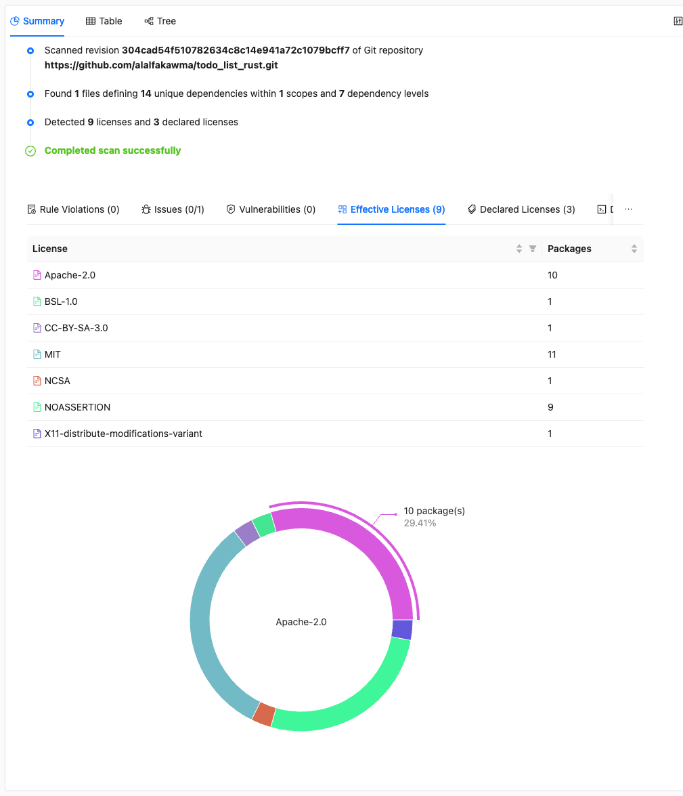

# Addressing WebApp Report Findings

This tutorial guides you through the process of addressing findings in an ORT WebApp report. Whether you're new to ORT or looking for a systematic approach, this checklist-style guide will help you resolve issues efficiently.

## Prerequisites

* An ORT scan result with a generated WebApp report
* Basic familiarity with [ORT's pipeline][walkthrough] and the WebApp report interface

## Overview

Addressing WebApp report findings follows a specific order. Each step builds on the previous one, so completing them in sequence produces the best results:

1. Resolve tooling issues
2. Configure project excludes
3. Review remaining policy violations
4. Address dependency violations (VCS paths, excludes, license corrections)
5. Make license choices
6. Add resolutions (last resort)

## 1. Resolve tooling issues

**What to check:** Open the WebApp report and navigate to the **Summary** tab. Look for the **Issues** section which lists errors and warnings from the Analyzer, Scanner, and Advisor.



**Why this matters:** Tooling issues can cascade into policy violations. For example, if ORT couldn't download a package's source code, it can't scan for licenses, which may trigger an "unknown license" policy violation. Fixing the root cause (the download error) is more effective than resolving the resulting policy violation.

**How to fix:** See [How to address tool issues][how-to-tool-issues] for solutions to common errors like download failures, revision errors, and license mapping problems.

**After fixing:** Re-run the affected tools (Analyzer, Scanner, Advisor) and regenerate the Evaluator and Reporter outputs:

```shell
ort evaluate --ort-file scan-result.yml --output-dir output --rules-file rules.kts
ort report --ort-file output/evaluation-result.yml --output-dir output --report-formats WebApp
```

## 2. Configure project excludes

**What to check:** In the WebApp report, click the button in the top-right corner and select the **.ort.yml file** tab. This shows ORT's view of your repository configuration.



**Why this matters:** ORT scans everything in your project by default, but you likely don't distribute everything. Tests, documentation, build scripts, and CI configuration aren't part of your release artifacts. Marking these as excluded prevents irrelevant license findings from triggering policy violations.

**What to configure:**

1. **Path excludes** - Mark directories and files not included in your release:
   * Test directories (`test/`, `tests/`, `spec/`)
   * Documentation (`docs/`, `*.md`)
   * Build configuration (`.github/`, `Makefile`)
   * Development tooling (`scripts/`, `.devcontainer/`)

2. **Scope excludes** - If your package manager supports dependency scopes, exclude non-production scopes:
   * `devDependencies` (npm/yarn)
   * `test` scope (Maven/Gradle)
   * `dev-dependencies` (Cargo)

**How to configure:** See [How to exclude dirs, files, or scopes][how-to-exclude] and [How to include dirs and files][how-to-include] for `.ort.yml` syntax and examples.

**After configuring:** Re-run the Evaluator and Reporter to see updated results:

```shell
ort evaluate --ort-file scan-result.yml --output-dir output --rules-file rules.kts
ort report --ort-file output/evaluation-result.yml --output-dir output --report-formats WebApp
```

**Verify:** Check the .ort.yml tab in the new WebApp report to confirm your excludes were picked up.

## 3. Review remaining policy violations

**What to check:** With tooling issues resolved and project excludes configured, review the **Rule Violations** section in the Summary tab.



**Understanding severity levels:**

| Severity | Meaning | Typical action |
| -------- | ------- | -------------- |
| **ERROR** | Blocks release, must be fixed | Fix before release |
| **WARNING** | Should be addressed | Fix when possible |
| **HINT** | Nice to fix | Address as time permits |

**Strategic approach:** Most organizations focus on ERROR-level violations first, as these typically block CI pipelines. Once all errors are resolved, move to warnings, then hints. See [License clearance strategies][license-clearance-strategies] for different approaches to managing compliance workload.

## 4. Address dependency violations

For each ERROR-level policy violation on a dependency, work through these sub-steps. Click on a violation in the WebApp report to see details including the package identifier, license findings, and file paths.

### 4a. Fix VCS path if the dependency is in a monorepo

**When this applies:** The violation message shows license findings from files that aren't part of the specific package you're using. This often happens when a package lives in a monorepo - ORT scanned the entire repository, but you only use one subdirectory.

**How to fix:** Add a [package curation][package-curations] with a VCS path to limit scanning to the relevant subdirectory. See [How to address a license policy violation][how-to-policy-violation] section 4 for details.

### 4b. Exclude non-distributed files in the dependency

**When this applies:** The scanned sources contain files that aren't in the release artifact you're using (tests, examples, documentation). Look at the file paths in the license findings - if they're in `test/`, `examples/`, or similar directories, they likely aren't distributed.

**How to fix:** Create a [package configuration][package-configurations] with path excludes. See [How to exclude dirs, files, or scopes][how-to-exclude] for the package configuration syntax.

### 4c. Correct license findings

**When this applies:** The scanner detected an incorrect license (false positive) or missed the actual license. This can happen when:

* Text resembles a license but isn't one
* A file contains multiple licenses but only one applies
* The scanner matched a similar but incorrect license

**How to fix:** Use license finding curations in a package configuration. See [How to correct licenses][how-to-correct-licenses] for examples.

**After making dependency fixes:** Re-run the Evaluator and Reporter to verify your fixes resolved the violations.

## 5. Make license choices

**When this applies:** Some packages are multi-licensed (e.g., `MIT OR Apache-2.0`), offering you a choice. If your policy requires you to select one license, you'll see this reflected in policy violations or the effective license display.



**How to fix:** Add license choices to your `.ort.yml` to select which license applies to your use. See [How to make a license choice][how-to-license-choice] for syntax.

**Important:** License choices are about selecting between offered options, not about changing what licenses apply. If the package doesn't offer a choice, you cannot add one.

## 6. Add resolutions (last resort)

**When this applies:** You've exhausted the options above but still have violations that cannot be fixed through curations, excludes, or license choices.

**Warning:** Resolutions are acknowledgments, not fixes. They mark a violation as "reviewed and accepted" but don't change the underlying data. The license will still appear in SBOMs and NOTICE files. Use resolutions sparingly and document your reasoning.

**How to add:** Add a rule violation resolution to your `.ort.yml`:

```yaml
resolutions:
  rule_violations:
  - message: "UNHANDLED_LICENSE.*Package::example:1.0.0"
    reason: "CANT_FIX_EXCEPTION"
    comment: "Accepted after legal review. See ticket LEGAL-123."
```

See the [resolutions reference][resolutions] for all available options.

## What's next

* [Automating policy checks][automating-policy-checks] - Set up ORT in CI to catch issues early
* [Generating SBOMs][generating-sboms] - Create compliance artifacts from your ORT results

## Related resources

* How-to guides
  * [How to address tool issues][how-to-tool-issues]
  * [How to exclude dirs, files, or scopes][how-to-exclude]
  * [How to include dirs and files][how-to-include]
  * [How to address a license policy violation][how-to-policy-violation]
  * [How to correct licenses][how-to-correct-licenses]
  * [How to make a license choice][how-to-license-choice]
* Explanation
  * [License clearance strategies][license-clearance-strategies]
* Reference
  * [Repository configuration (.ort.yml)][ort-yml]
  * [Package configurations][package-configurations]
  * [Package curations][package-curations]
  * [Resolutions][resolutions]

[automating-policy-checks]: automating-policy-checks.md
[generating-sboms]: walkthrough/generating-sboms.md
[how-to-correct-licenses]: ../how-to-guides/how-to-correct-licenses.md
[how-to-exclude]: ../how-to-guides/how-to-exclude-dirs-files-or-scopes.md
[how-to-include]: ../how-to-guides/how-to-include-dirs-and-files.md
[how-to-license-choice]: ../how-to-guides/how-to-make-a-license-choice.md
[how-to-policy-violation]: ../how-to-guides/how-to-address-a-license-policy-violation.md
[how-to-tool-issues]: ../how-to-guides/how-to-address-tool-issues.md
[license-clearance-strategies]: ../explanation/license-clearance-strategies.md
[ort-yml]: ../reference/configuration/ort-yml.md
[package-configurations]: ../reference/configuration/package-configurations.md
[package-curations]: ../reference/configuration/package-curations.md
[resolutions]: ../reference/configuration/resolutions.md
[walkthrough]: walkthrough/index.md
