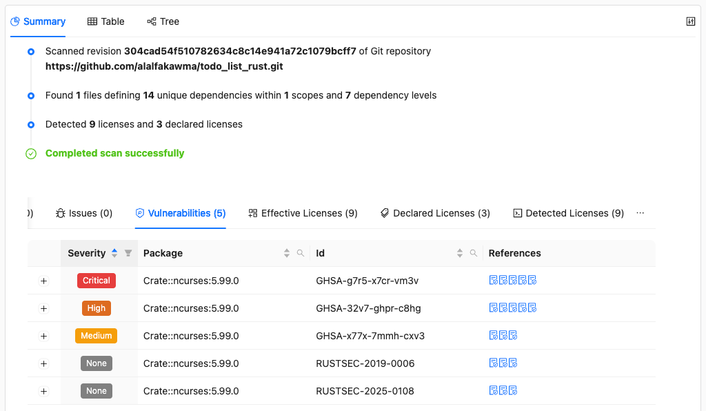

# Checking for Vulnerabilities

This is part of the [ORT walkthrough tutorial](index.md). Make sure you've completed the [scanning for copyrights and licenses](scanning-for-copyrights-and-licenses) step before continuing.

The [Advisor] checks your dependencies against vulnerability databases like [OSV](https://osv.dev/) and [VulnerableCode](https://github.com/aboutcode-org/vulnerablecode) to find known security issues. You'll learn how ORT queries these services, interprets vulnerability severity, and presents findings so you can assess which issues need attention in your project.

## Running the Advisor

```shell
docker run --rm \
  -v "$(pwd)/todo_list_rust":/workspace \
  -v "$(pwd)/ort-config":/home/ort/.ort/config \
  -v "$(pwd)/ort-output":/ort-output \
  ghcr.io/oss-review-toolkit/ort:76.0.0 \
  advise \
    --ort-file /ort-output/scan-result.yml \
    --output-dir /ort-output \
    --advisors OSV
```

New options:

| Option       | Description                                                          |
| ------------ | -------------------------------------------------------------------- |
| `--advisors` | Which vulnerability database(s) to query (OSV, VulnerableCode, etc.) |

You should see output like this:

```
Looking for ORT configuration in the following file:
        /home/ort/.ort/config/config.yml (does not exist)

The following 1 advisor(s) are enabled:
        OSV
Wrote advisor result to '/ort-output/advisor-result.yml' (0.16 MiB) in 145.723250ms.
The advice took 1.149182543s.
1 of 11 package(s) (not counting excluded ones) are vulnerable, with 5 vulnerabilities in total.
Resolved issues: 0 errors, 0 warnings, 0 hints.
Unresolved issues: 0 errors, 0 warnings, 0 hints.
```

The advisor found 5 vulnerabilities in 1 package.

## Viewing vulnerabilities in the Web App

Generate a new web app report from the advisor results:

```shell
docker run --rm \
  -v "$(pwd)/ort-config":/home/ort/.ort/config \
  -v "$(pwd)/ort-output":/ort-output \
  ghcr.io/oss-review-toolkit/ort:76.0.0 \
  -P ort.forceOverwrite=true \
  report \
    --ort-file /ort-output/advisor-result.yml \
    --output-dir /ort-output \
    --report-formats WebApp
```

Open `ort-output/scan-report-web-app.html` in your browser.

### Vulnerabilities summary



The Summary tab now shows a **Vulnerabilities** section listing the security issues found in your dependencies. You can see the severity, affected package, and vulnerability identifiers (CVE, GHSA, etc.).

Click on any vulnerability to see more details, including links to the original advisory and information about affected versions.

## What's next

We now have a complete picture of our project: dependencies, licenses, and vulnerabilities. Next, let's use the [Evaluator] to [check all of this against policy rules](running-policy-checks.md).

## Related resources

* How-to guides
  * [How to check and remediate vulnerabilities](../../how-to-guides/how-to-check-and-remediate-vulnerabilities-in-dependencies.md)
* Reference
  * [Advisor CLI][advisor]

[advisor]: ../../reference/cli/advisor.md
[evaluator]: ../../reference/cli/evaluator.md
