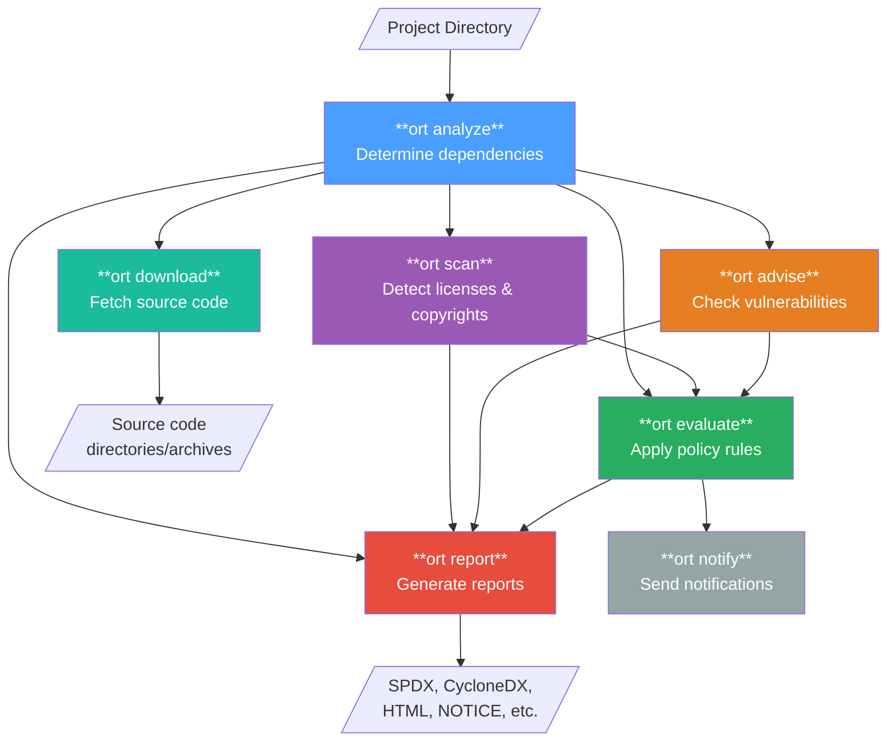

# Using ORT on your first project

This tutorial walks you through the complete ORT workflow using a real project. You'll learn how to analyze dependencies, scan for licenses, check for vulnerabilities, evaluate against policies, and generate reports.

By the end, you'll understand how ORT's tools work together and be ready to use ORT on your own projects.

## Prerequisites

* [Docker](https://docs.docker.com/get-docker/) installed on your machine

If you prefer to install ORT differently, see the [installation guide](../../getting-started/installation.md).

## Setting up the workspace

Create a directory for this tutorial and set up the required folders:

```shell
mkdir ort-walkthrough
cd ort-walkthrough
mkdir ort-output
```

Clone the default ORT configuration repository - it contains corrections for open source packages ([package curations][package-curations], [package configurations][package-configurations]), [license classifications][license-classifications], and other [configuration files][configuration] that ORT uses:

```shell
git clone https://github.com/oss-review-toolkit/ort-config.git
```

## Setting up the test project

We'll use a small Rust CLI application as our example project. Clone it and check out a specific commit to ensure we're all working with the same code:

```shell
git clone https://github.com/alalfakawma/todo_list_rust.git
cd todo_list_rust
git checkout 304cad54f510782634c8c14e941a72c1079bcff7
cd ..
```

This is a simple todo list application with a handful of dependencies - enough to demonstrate ORT's capabilities without overwhelming output.

Your workspace should now look like this:

```
ort-walkthrough/
├── ort-config/        # ORT configuration files
├── ort-output/        # Where ORT will write results
└── todo_list_rust/    # The project we're analyzing
```

## The ORT pipeline

ORT consists of several commands that work together. The diagram below shows how they relate:



The [Analyzer] is always the first step - it determines what dependencies your project has. All other commands build on its output. You can then run the [Scanner], [Advisor], [Evaluator], and [Reporter] in various combinations depending on your needs.

## Running ORT with Docker

We'll use ORT's official Docker image throughout this tutorial. Pull it first:

```shell
docker pull ghcr.io/oss-review-toolkit/ort:76.0.0
```

## Let's begin

With the test project cloned and Docker ready, let's start by [analyzing the project's dependencies](analyzing-a-project-for-dependencies.md).

## Related resources

* Reference
  * [Advisor CLI][advisor]
  * [Analyzer CLI][analyzer]
  * [Evaluator CLI][evaluator]
  * [Reporter CLI][reporter]
  * [Scanner CLI][scanner]

[advisor]: ../../reference/cli/advisor.md
[analyzer]: ../../reference/cli/analyzer.md
[configuration]: ../../reference/configuration/index.md
[evaluator]: ../../reference/cli/evaluator.md
[license-classifications]: ../../reference/configuration/license-classifications.md
[package-configurations]: ../../reference/configuration/package-configurations.md
[package-curations]: ../../reference/configuration/package-curations.md
[reporter]: ../../reference/cli/reporter.md
[scanner]: ../../reference/cli/scanner.md
