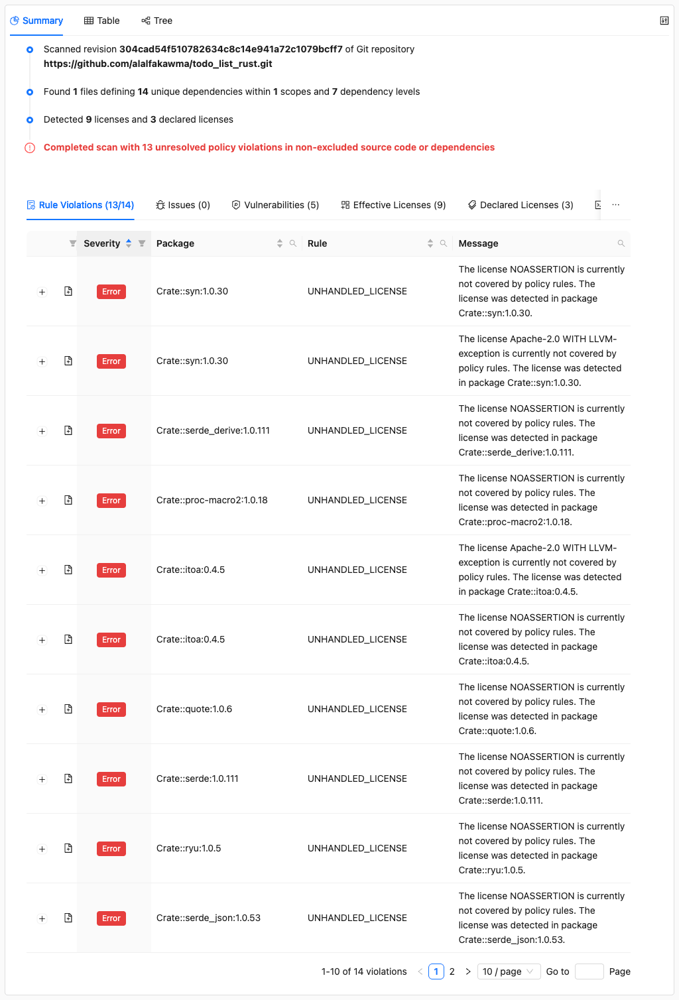

# Running Policy Checks

This is part of the [ORT walkthrough tutorial](index.md). Make sure you've completed the [checking for vulnerabilities](checking-for-vulnerabilities.md) step before continuing.

The [Evaluator] applies policy rules to your scan results, checking which licenses are allowed, flagging packages that need review, and enforcing compliance requirements. You'll see how rule violations are reported and understand the difference between errors, warnings, and hints that guide your remediation efforts.

## Setting up rules

ORT includes example rules that you can use as a starting point. Copy the example rules file into your config directory:

```shell
curl -o ort-config/rules.kts \
  https://raw.githubusercontent.com/oss-review-toolkit/ort/main/examples/example.rules.kts
```

## Running the Evaluator

```shell
docker run --rm \
  -v "$(pwd)/todo_list_rust":/workspace \
  -v "$(pwd)/ort-config":/home/ort/.ort/config \
  -v "$(pwd)/ort-output":/ort-output \
  ghcr.io/oss-review-toolkit/ort:76.0.0 \
  evaluate \
    --ort-file /ort-output/advisor-result.yml \
    --output-dir /ort-output \
    --rules-file /home/ort/.ort/config/rules.kts
```

New options:

| Option         | Description                               |
| -------------- | ----------------------------------------- |
| `--rules-file` | The Kotlin script containing policy rules |

You should see output like this:

```
Looking for ORT configuration in the following file:
        /home/ort/.ort/config/config.yml (does not exist)

Looking for evaluator-specific configuration in the following files, directories and resources:
        /home/ort/.ort/config/copyright-garbage.yml
        /home/ort/.ort/config/license-classifications.yml
        /home/ort/.ort/config/resolutions.yml
        /home/ort/.ort/config/rules.kts
The following 14 rule violations have been found:
ERROR: UNHANDLED_LICENSE - Crate::syn:1.0.30 - NOASSERTION - The license NOASSERTION is currently not covered by policy rules. The license was detected in package Crate::syn:1.0.30.
ERROR: UNHANDLED_LICENSE - Crate::syn:1.0.30 - Apache-2.0 WITH LLVM-exception - The license Apache-2.0 WITH LLVM-exception is currently not covered by policy rules. The license was detected in package Crate::syn:1.0.30.
ERROR: UNHANDLED_LICENSE - Crate::serde_derive:1.0.111 - NOASSERTION - The license NOASSERTION is currently not covered by policy rules. The license was detected in package Crate::serde_derive:1.0.111.
ERROR: UNHANDLED_LICENSE - Crate::proc-macro2:1.0.18 - NOASSERTION - The license NOASSERTION is currently not covered by policy rules. The license was detected in package Crate::proc-macro2:1.0.18.
ERROR: UNHANDLED_LICENSE - Crate::itoa:0.4.5 - Apache-2.0 WITH LLVM-exception - The license Apache-2.0 WITH LLVM-exception is currently not covered by policy rules. The license was detected in package Crate::itoa:0.4.5.
ERROR: UNHANDLED_LICENSE - Crate::itoa:0.4.5 - NOASSERTION - The license NOASSERTION is currently not covered by policy rules. The license was detected in package Crate::itoa:0.4.5.
ERROR: UNHANDLED_LICENSE - Crate::quote:1.0.6 - NOASSERTION - The license NOASSERTION is currently not covered by policy rules. The license was detected in package Crate::quote:1.0.6.
ERROR: UNHANDLED_LICENSE - Crate::serde:1.0.111 - NOASSERTION - The license NOASSERTION is currently not covered by policy rules. The license was detected in package Crate::serde:1.0.111.
ERROR: UNHANDLED_LICENSE - Crate::ryu:1.0.5 - NOASSERTION - The license NOASSERTION is currently not covered by policy rules. The license was detected in package Crate::ryu:1.0.5.
ERROR: UNHANDLED_LICENSE - Crate::serde_json:1.0.53 - NOASSERTION - The license NOASSERTION is currently not covered by policy rules. The license was detected in package Crate::serde_json:1.0.53.
ERROR: UNHANDLED_LICENSE - Crate::serde_json:1.0.53 - Apache-2.0 WITH LLVM-exception - The license Apache-2.0 WITH LLVM-exception is currently not covered by policy rules. The license was detected in package Crate::serde_json:1.0.53.
WARNING: VULNERABILITY_IN_PACKAGE - Crate::ncurses:5.99.0 - The package Crate::ncurses:5.99.0 has a vulnerability
ERROR: MISSING_CONTRIBUTING_FILE - The project's code repository does not contain the file 'CONTRIBUTING.md'.
ERROR: MISSING_README_FILE - The project's code repository does not contain the file 'README.md'.
The evaluation of 1 script(s) took 6.894772254s.
Wrote evaluation result to '/ort-output/evaluation-result.yml' (0.17 MiB) in 157.140375ms.
Resolved rule violations: 0 errors, 0 warnings, 0 hints.
Unresolved rule violations: 13 errors, 1 warning, 0 hints.
There are 14 unresolved rule violations with a severity equal to or greater than the WARNING threshold.
```

The evaluator found 14 rule violations: unhandled licenses, a vulnerability warning, and missing project files.

## Viewing rule violations in the Web App

Generate a new web app report from the evaluator results:

```shell
docker run --rm \
  -v "$(pwd)/ort-config":/home/ort/.ort/config \
  -v "$(pwd)/ort-output":/ort-output \
  ghcr.io/oss-review-toolkit/ort:76.0.0 \
  -P ort.forceOverwrite=true \
  report \
    --ort-file /ort-output/evaluation-result.yml \
    --output-dir /ort-output \
    --report-formats WebApp
```

Open `ort-output/scan-report-web-app.html` in your browser.

### Rule violations



The Summary tab now shows a **Rule Violations** section listing all policy violations found by the evaluator. You can see unhandled licenses that need to be handled by your policy. See [how to address a license policy violation](../../how-to-guides/how-to-address-a-license-policy-violation.md) for details on resolving these.

## Refining scan results

Looking at the scan results in detail, we can see some issues that could be refined. Here are two examples:

1. **Test files included in scan**: `Crate::unicode-xid:0.2.0` has license findings in `src/tests.rs`, which isn't part of the released package
2. **Undetermined license match**: `Crate::libc:0.2.71` has NOASSERTION findings in `README.md`, which contains text like "This project is licensed under either of"

We can fix these using [package configurations](../../reference/configuration/package-configurations.md). Package configurations are applied during evaluation to correct or exclude findings in dependency sources.

### Excluding test files

Create **`ort-config/package-configurations/Crate/_/unicode-xid/0.2.0/source-artifact.yml`**:

```yaml
id: "Crate::unicode-xid:0.2.0"
source_artifact_url: "https://crates.io/api/v1/crates/unicode-xid/0.2.0/download"
path_excludes:
- pattern: "unicode-xid-0.2.0/src/tests.rs"
  reason: "TEST_OF"
  comment: "Test file not included in released crate."
```

The `source_artifact_url` must match the URL in your scan results exactly. The `pattern` must match the full path as it appears in scan results - for source artifacts, this includes the extracted archive directory name (e.g., `unicode-xid-0.2.0/`).

### Correcting license findings

Create **`ort-config/package-configurations/Crate/_/libc/0.2.71/vcs.yml`**:

```yaml
id: "Crate::libc:0.2.71"
vcs:
  type: "Git"
  url: "https://github.com/rust-lang/libc.git"
  revision: "8712132baa9c487b229ff1489859f3ea21c70432"
license_finding_curations:
- path: "README.md"
  start_lines: "71"
  line_count: 1
  detected_license: "NOASSERTION"
  reason: "INCORRECT"
  comment: "Introductory text, not a license statement."
  concluded_license: "NONE"
- path: "README.md"
  start_lines: "95"
  line_count: 1
  detected_license: "NOASSERTION"
  reason: "INCORRECT"
  comment: "Contribution notice, not a license statement."
  concluded_license: "NONE"
```

The `vcs` section must match the repository provenance in your scan results. Use `license_finding_curations` to correct specific license detections that are incorrect.

### Re-running the evaluator

After creating the package configuration files, re-run the evaluator:

```shell
docker run --rm \
  -v "$(pwd)/todo_list_rust":/workspace \
  -v "$(pwd)/ort-config":/home/ort/.ort/config \
  -v "$(pwd)/ort-output":/ort-output \
  ghcr.io/oss-review-toolkit/ort:76.0.0 \
  -P ort.forceOverwrite=true \
  evaluate \
    --ort-file /ort-output/advisor-result.yml \
    --output-dir /ort-output \
    --rules-file /home/ort/.ort/config/rules.kts
```

The package configurations in `ort-config/package-configurations` will be automatically picked up, excluding the test file findings and correcting the NOASSERTION license detections.

See [How to exclude dirs, files, or scopes](../../how-to-guides/how-to-exclude-dirs-files-or-scopes.md) and [How to correct licenses](../../how-to-guides/how-to-correct-licenses.md) for more details.

## What's next

The evaluator has checked our project against policy rules. Now let's use the [Reporter] to [generate SBOMs and NOTICE files](generating-sboms.md) to satisfy compliance requirements.

## Related resources

* How-to guides
  * [How to classify licenses](../../how-to-guides/how-to-classify-licenses.md)
  * [How to address a license policy violation](../../how-to-guides/how-to-address-a-license-policy-violation.md)
  * [How to correct licenses](../../how-to-guides/how-to-correct-licenses.md)
  * [How to exclude dirs, files, or scopes](../../how-to-guides/how-to-exclude-dirs-files-or-scopes.md)
* Reference
  * [Evaluator CLI][evaluator]
  * [Evaluator rules DSL - specify your own policy checks](../../reference/configuration/evaluator-rules.md)
  * [License classifications - categorize license for use in policy checks](../../reference/configuration/license-classifications.md)
  * [Package configurations - correct or exclude findings in dependency sources](../../reference/configuration/package-configurations.md)

[evaluator]: ../../reference/cli/evaluator.md
[reporter]: ../../reference/cli/reporter.md
