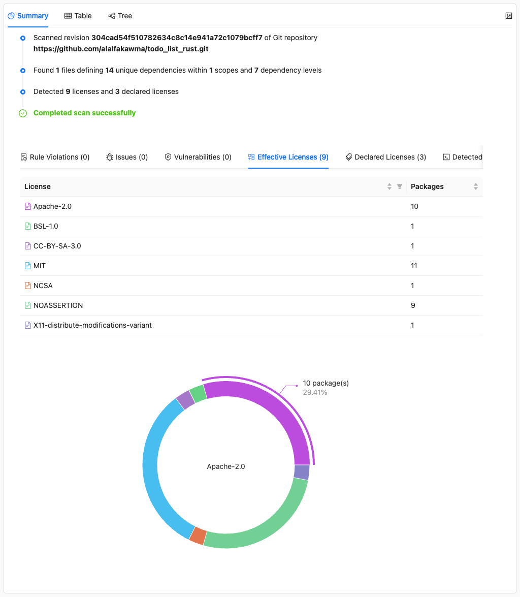
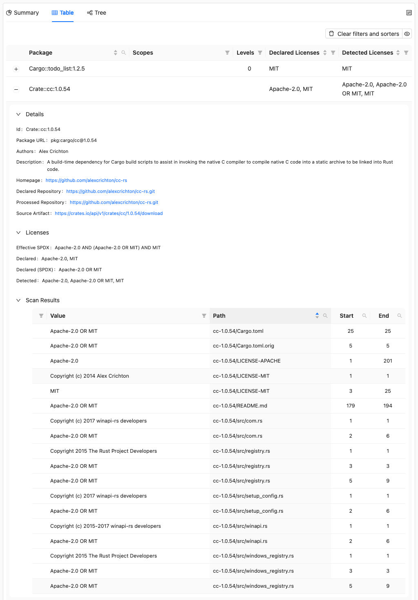

# Scanning for Copyrights and Licenses

This is part of the [ORT walkthrough tutorial](index.md). Make sure you've completed the [visualizing results](visualizing-results.md) step before continuing.

The [Scanner] downloads source code for each package and runs license scanners to detect licenses and copyrights in the actual source files. This goes beyond the declared licenses we saw in the analyzer results, finding what's actually in the code.

The scanner automatically uses the [Downloader](../../reference/cli/downloader.md) to fetch source code before scanning. If you need to archive source code separately (e.g., for license compliance), see [How to download sources for projects and dependencies](../../how-to-guides/how-to-download-sources-for-projects-and-dependencies.md).

ORT supports several scanners. In this tutorial, we'll use [ScanCode](https://github.com/aboutcode-org/scancode-toolkit), which is included in the ORT Docker image.

## Running the Scanner

<!-- TODO: Remove ort.scanner.scanners.ScanCode.options.commandLineNonConfig, use release with #11324 PR -->

```shell
docker run --rm \
  -v "$(pwd)/todo_list_rust":/workspace \
  -v "$(pwd)/ort-config":/home/ort/.ort/config \
  -v "$(pwd)/ort-output":/ort-output \
  ghcr.io/oss-review-toolkit/ort:76.0.0 \
  -P ort.scanner.scanners.ScanCode.options.commandLineNonConfig=--timeout,300 \
  scan \
    --ort-file /ort-output/analyzer-result.yml \
    --output-dir /ort-output \
    --scanners ScanCode
```

New options:

| Option       | Description                 |
| ------------ | --------------------------- |
| `--ort-file` | The analyzer result to scan |
| `--scanners` | Which scanner(s) to use     |

The scan takes a few minutes as it downloads and scans all packages. You should see output like this:

```
Looking for ORT configuration in the following file:
        /home/ort/.ort/config/config.yml (does not exist)

Scanning projects with:
        ScanCode (version 32.4.1)
Scanning packages with:
        ScanCode (version 32.4.1)
Wrote scan result to '/ort-output/scan-result.yml' (0.15 MiB) in 239.551292ms.
The scan took 1m 46.534437202s.
Resolved issues: 0 errors, 0 warnings, 0 hints.
Unresolved issues: 0 errors, 0 warnings, 0 hints.
```

## Viewing scan results in the Web App

Delete the old web app report and generate a new one from the scan results:

```shell
docker run --rm \
  -v "$(pwd)/ort-config":/home/ort/.ort/config \
  -v "$(pwd)/ort-output":/ort-output \
  ghcr.io/oss-review-toolkit/ort:76.0.0 \
  -P ort.forceOverwrite=true \
  report \
    --ort-file /ort-output/scan-result.yml \
    --output-dir /ort-output \
    --report-formats WebApp
```

Open `ort-output/scan-report-web-app.html` in your browser.

### Effective licenses



The Summary tab now shows **Effective Licenses** - the licenses actually found in the source code. Notice how they differ from the declared licenses we saw earlier. The scanner found licenses that weren't declared in the package metadata.

### Package scan details



Click on any package to see its scan results. The **Scan Results** section shows exactly which files contain license information and what was detected. This level of detail helps you understand where licenses come from and verify the findings.

## What's next

The scanner has revealed what licenses are actually in the code. Next, let's use the [Advisor] to [check for known security vulnerabilities](checking-for-vulnerabilities.md).

## Related resources

* How-to guides
  * [How to download sources for projects and dependencies](../../how-to-guides/how-to-download-sources-for-projects-and-dependencies.md)
* Reference
  * [Scanner CLI](../../reference/cli/scanner.md)

[advisor]: ../../reference/cli/advisor.md
[scanner]: ../../reference/cli/scanner.md
