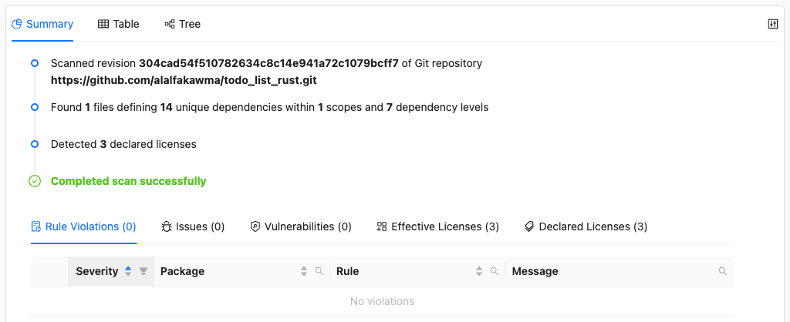
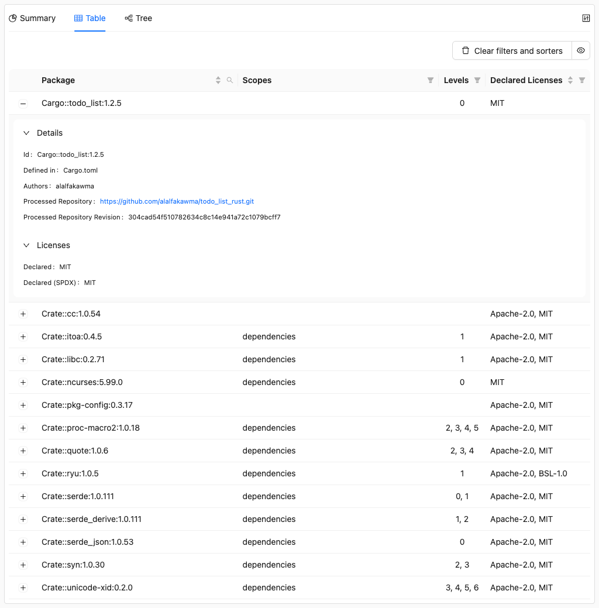
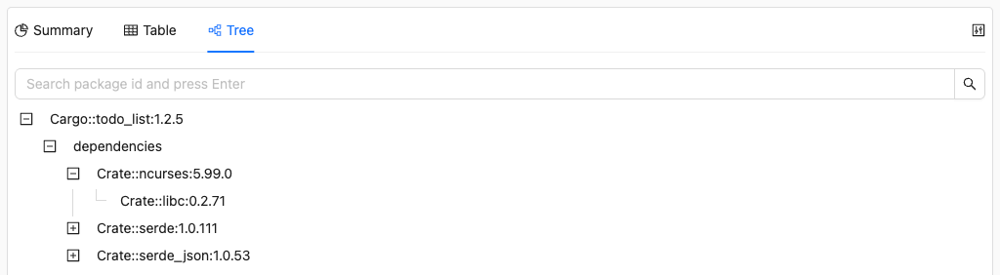
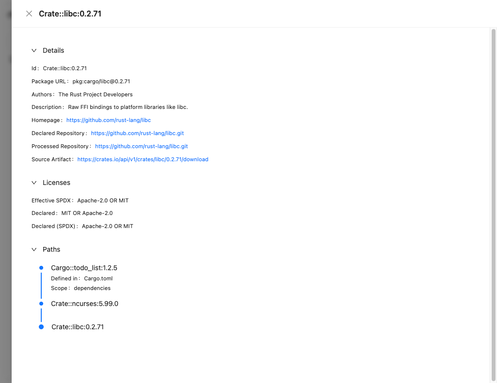

# Visualizing Results

This is part of the [ORT walkthrough tutorial](index.md). Make sure you've completed the [analyzing a project for dependencies](analyzing-a-project-for-dependencies.md) step before continuing.

The [Reporter] can generate many output formats from any ORT result file, whether from the [Analyzer], [Scanner], [Advisor], or [Evaluator]. The **WebApp** format is particularly useful for exploring results interactively at any stage of the pipeline. Here you'll generate your first report and learn to navigate its interface, understanding how to find dependency details, licenses, and issues. This same report will show progressively more information as we add scanner and evaluator results in later steps.

Let's generate a web app to visualize our analyzer results.

## Generating the Web App

Run the reporter with the `WebApp` format:

```shell
docker run --rm \
  -v "$(pwd)/todo_list_rust":/workspace \
  -v "$(pwd)/ort-config":/home/ort/.ort/config \
  -v "$(pwd)/ort-output":/ort-output \
  ghcr.io/oss-review-toolkit/ort:76.0.0 \
  report \
    --ort-file /ort-output/analyzer-result.yml \
    --output-dir /ort-output \
    --report-formats WebApp
```

Note that we no longer need to mount the project directory, the reporter only needs the ORT result file.

New options compared to the analyzer command:

| Option             | Description                                  |
| ------------------ | -------------------------------------------- |
| `--ort-file`       | The ORT result file to generate reports from |
| `--report-formats` | Which report format(s) to generate           |

You should see output like this:

```
Looking for ORT configuration in the following file:
        /home/ort/.ort/config/config.yml (does not exist)

Generating 'WebApp' report(s) in thread 'DefaultDispatcher-worker-2'...
Successfully created 'WebApp' report at '/ort-output/scan-report-web-app.html'.
Generating 'WebApp' report(s) took 185.481084ms.
Created 1 of 1 report(s) in 188.994708ms.
```

## Exploring the results

Open `ort-output/scan-report-web-app.html` in your browser.

### Summary tab



The Summary tab shows an overview of the analysis:

* **Scanned project**: The Git repository and revision that was analyzed
* **Dependencies found**: 14 unique dependencies within 1 scope across 7 dependency levels
* **Declared licenses**: 3 different licenses declared by the packages

The table at the bottom will show more information once we run the scanner and evaluator.

### Table tab



The Table tab lists all projects and packages (dependencies). You can expand each entry to see its details.

### Tree tab



The Tree tab shows the same information hierarchically, so you can see how dependencies relate to each other. Click on any package name to open its details.

### Dependency details



When you click on a package, you'll see:

* **Package identification**: Name, version, PURL, and how to access it (VCS/artifacts)
* **Metadata**: Authors and other package information
* **Licenses**: What licenses are declared for this package
* **Paths**: How this dependency is included in your project (the transitive dependency chain)

## What's missing

You'll notice some sections are empty or sparse. That's because we've only run the analyzer so far. As we continue through the tutorial and run the scanner, advisor, and evaluator, more information will appear in the web app.

## What's next

Now that we can visualize our results, let's continue to the [Scanner] to [detect what licenses are actually in the source code](scanning-for-copyrights-and-licenses).

## Related resources

* How-to guides
  * [How to generate SBOMs - whether CycloneDX or SPDX](../../how-to-guides/how-to-generate-sboms.md)
* Reference
  * [Reporter CLI](../../reference/cli/reporter.md)

[advisor]: ../../reference/cli/advisor.md
[analyzer]: ../../reference/cli/analyzer.md
[evaluator]: ../../reference/cli/evaluator.md
[reporter]: ../../reference/cli/reporter.md
[scanner]: ../../reference/cli/scanner.md
